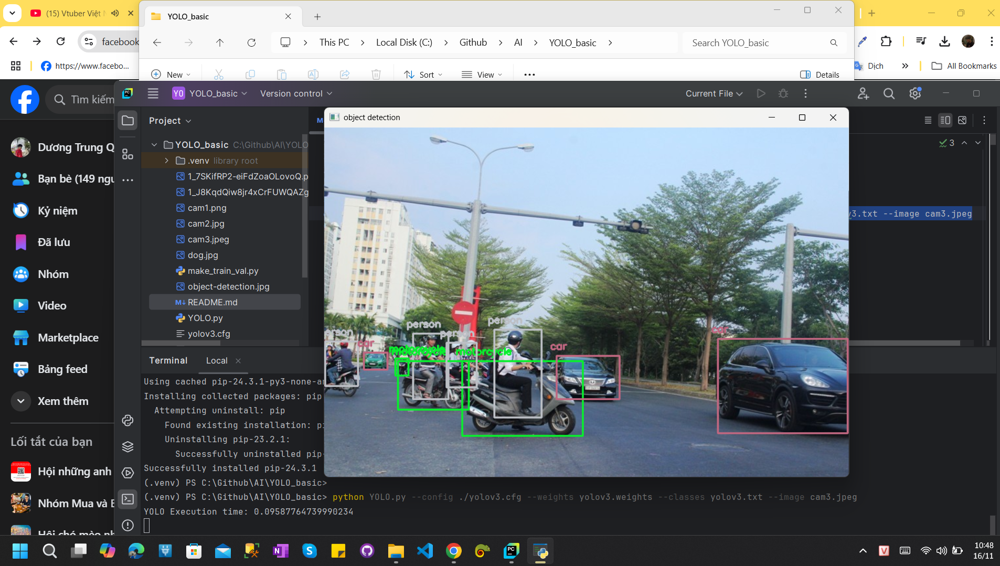

# yolo_basic (YOLOv3)

1. Download weights file from https://pjreddie.com/media/files/yolov3.weights
2. Install opencv : pip install opencv-python
3. Run and enjoy: python YOLO.py --config ./yolov3.cfg --weights yolov3.weights --classes yolov3.txt --image cam3.jpeg
   
Trong đó:
- cam2.jpg: là tên file ảnh bạn muốn nhận dạng, bạn có thể thay bằng ảnh nào tùy thích.
- yolov3.txt: Là file chứa tên của các đối tượng phát hiện được.
- yolov3.weights: Là file pretrain weights 
- yolov3.cfg: Là file config của YOLO.

